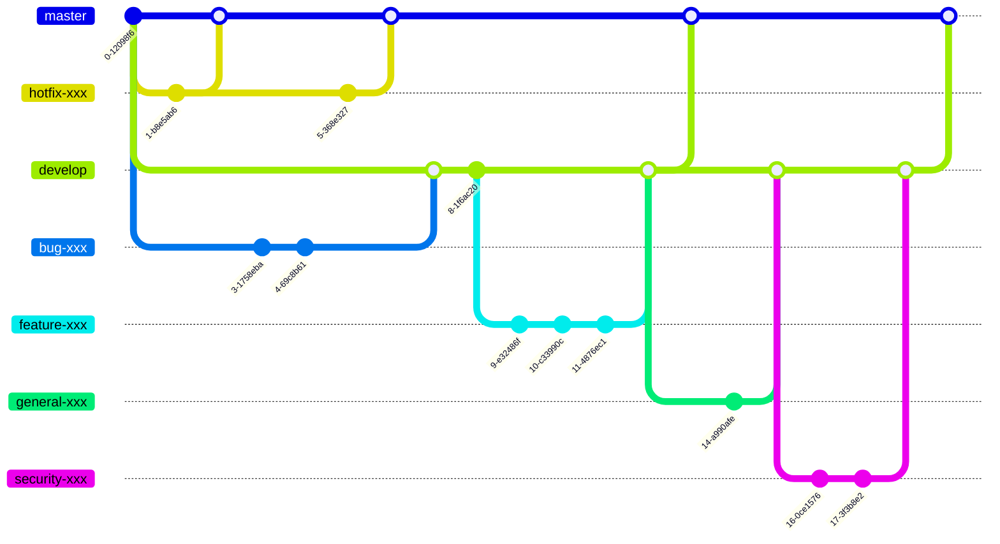

## Development environment

The setup and configuration of the development environment is in the hands of every developer themselves. However, it is recommended to follow the setup instructions in the [Developer-Guide](https://github.com/Karaka-Management/Developer-Guide/blob/develop/general/setup.md).

## Code of conduct

Every organization member and contributor to the organization must follow the [Code of Conduct](../Policies%20&%20Guidelines/Code%20of%20Conduct.md).

## Becoming a contributor

For public repositories you can immediately start by creating forks and pull requests. For private repositories which are necessary to setup the complete developer environment, feel free to request access. Please not that we may not immediately give you access to private repositories and instead will give you smaller tasks regarding public repositories. Please contact info@jingga.app for more details. (**R1**)

For all contributions our [Contributor License Agreement "CLA"](https://github.com/Karaka-Management/Organization-Guide/blob/master/Processes/HR/Hiring/Individual%20Contributor%20License%20Agreement.md) comes into effect. (**R2**)

## Code changes

### Topics / Tasks / Todos

Generally, the development philosophy is result orientated. This means that anyone can propose tasks, pick up existing tasks or right away implement their code changes. However, implementing code changes without consulting with a senior developer in advance has a much higher risk of code changes not getting admitted. The easiest way to discuss a code change idea in advance are the github [issues](https://github.com/Karaka-Management/Karaka/issues) or [discussions](https://github.com/Karaka-Management/Karaka/discussions).

Developers are encouraged to pick open tasks with high priorities according to their own skill level. Senior developers may  directly assign tasks to developers based on their importance. New developers may find it easier to start with a task that has a low  priority as they often also have a lower difficulty.

Open tasks can be found in the project overview: [Todos](https://github.com/orgs/Karaka-Management/projects/10)

Tasks currently in development are prefixed in the priority column with an asterisk `*` and a name tag in the task description of the developer who is working on the task.

The open tasks are reviewed once a month by a senior developer. The senior developer updates the project overview if necessary and requests feedback regarding development status of important tasks under development. During this process important tasks may also get directly assigned to developers. This review is performed on a  judgmental bases of the senior basis.

### Quality

#### Code style

Code changes must follow the [style guidelines](https://github.com/Karaka-Management/Developer-Guide/tree/develop/standards) (**R3**). Additionally, the automatic code style inspection tools must return no errors, failures or warnings. Developers should test their changes with inspection tools and configurations mentioned in the [inspection documentation](https://github.com/Karaka-Management/Developer-Guide/blob/develop/quality/inspections.md) in advance before submitting them for review. (**R4**)

In rare cases errors, failures or warnings during the automatic inspection are acceptable. Reasons can be for example special cases which are difficult automatize or must be individually configured in the inspection settings. If this is the case for a code change and if inspection configuration changes are necessary are decided by the senior developer performing the code review. (**R5**)

Automated checks which are run during the review process (**R4**):

```sh
php ./vendor/bin/phpcs ./ --standard="Build/Config/phpcs.xml"
php ./vendor/bin/php-cs-fixer fix ./ --config=Build/Config/.php-cs-fixer.php --allow-risky=yes
php ./vendor/bin/phpcbf --standard=Build/Config/phpcs.xml ./
php ./vendor/bin/rector process --dry-run --config Build/Config/rector.php ./
npx eslint ./ -c ./Build/Config/.eslintrc.json
```

#### Tests

Code changes must follow the inspection guidelines (i.e. code coverage) mentioned in the [inspection documentation](https://github.com/Karaka-Management/Developer-Guide/blob/develop/quality/inspections.md) (**R6**). Developers should test their changes with inspection tools and configurations mentioned in the [inspection documentation](https://github.com/Karaka-Management/Developer-Guide/blob/develop/quality/inspections.md) in advance before submitting them for review. (**R7**)

In rare cases it might be not possible to follow the inspection guidelines. In such cases the senior developer performing the code review may decide if the code change still gets accepted. (**R8**)

Automated tests which are run during the review process (**R7**):

```sh
php ./vendor/bin/phpunit -c tests/PHPUnit/phpunit_default.xml
php ./vendor/bin/phpstan analyse --no-progress -l 9 -c Build/Config/phpstan.neon ./
npx jasmine-node ./
./cOMS/tests/test.sh
```

Additional inspections which are run but might be ignored during the review depending on the use case are mentioned in the [inspection documentation](https://github.com/Karaka-Management/Developer-Guide/blob/develop/quality/inspections.md) as other checks. (**R7**)

#### Performance

Developers should occasionaly check performance statistics. At this point no target metrics are defined.

Since the primary application is a web based application a similar tool as the Google lighthouse tool can be used to inspect the application for best practicies which can significantly improve the application performance. The sitespeed.io tool shows potential performance improvements and slow pages. With the php trace and profiler enabled in the `php.ini` file the VM automatically generates profiling and trace reports for every web request. These can be found in the webgrind logs directory and inspected in webgrind and dropped into the trace visualizer for a flame chart visualization. With mysqldumpslow you can inspect slow sql queries which may need optimization.

1. Automatic trace and benchmark generation with every web request in `/var/www/html/webgrind/Logs`
2. Webgrind view `http://vm_ip:82`
3. Trace visualization `http://vm_ip:81`
   1. Download the latest trace from `http://vm_ip:82/Logs`
   2. Drag and drop that downloaded `*.xt` file in the trace visualizer
4. `sitespeed.io ./Build/Helper/Scripts/sitespeedDemoUrls.txt -b chrome --outputFolder /var/www/html/sitespeed`
5. Slow query inspection.

```sh
mysqldumpslow -t 10 /var/log/mysql/mysql-slow.log
mysqldumpslow -t 10 -s l /var/log/mysql/mysql-slow.log
```

#### Code review

In addition to the automatic code review performed by the various inspection tools such as (phpcs, phpstan, phpunit, eslint and custom scripts) a senior developer must check the proposed code change before it is merged with the respective `develop` branch. Only upon the approval by the reviewer a code change requests gets merged as no other developers have permission in the software to make such code merges.

In case a code change request is not approved the reviewer states the reason for the decision, this may include some tips and requests which will allow the contributor to make improvements so that the code change may get approved.

If the code reviewer only finds minor issues with the proposed code change the reviewer may make small changes to the proposed code change and inform the contributor to speed up the implementation process. Code reviewers are encouraged to do this with new contributors to avoid long iteration processes and to not discourage new developers. However, communication is key and severe issues with code change requests or if the contributor already made multiple code change requests in the past the reviewer should not implement the improvements by himself and rather decline the code change requests with his reasoning. (**R5**+**R8**)

#### Demo

Some code changes may also require changes or extensions in the demo setup scripts. The demo setup script try to simulate a real world use case by generating and modifying mostly random data. This is also a good way to setup and “manually” test the code changes in a larger picture. The demo setup script can be found in the [demoSetup](https://github.com/Karaka-Management/demoSetup) repository. The demo setup script takes a long time due to the large amount of user input simulated data which is generated. Therefore it is recommended to run this only sporadically. (**R9**)

```sh
sudo -u www-data php -dxdebug.remote_enable=1 -dxdebug.start_with_request=yes -dxdebug.mode=coverage,develop,debug demoSetup/setup.php
```

#### Documentation

Occasionally new code or code changes also require new documentation or documentation changes. Developers should make sure that the new code is also reflected in the existing documentation ([Developer-Guide](), [User-Guide]() and/or module documentation) or if additional documentation is necessary.

#### Improvements, features, bugs

If a developer (or employee in general) has an idea for an improvement, feature or finds a potential bug it should be reported at https://github.com/Karaka-Management/Karaka/issues. A senior developer has to check these issues and decide how to proceed with them. The decision how to proceed with the issue must be explained by the senior developer as a response in the issue. Possible steps are:

* Accept the issue and put the task into the [Todos](https://github.com/orgs/Karaka-Management/projects/10)
* Dismiss the issue with an explanation

### Release flow

In case SCSS/CSS or JS files got changed they must get re-built locally before comitting the code change:

```sh
npx esbuild Web/Backend/js/backend.js --bundle --outfile=Install/Application/Backend/js/backend.min.js --minify
scss cssOMS/styles.scss > cssOMS/styles.css
```

For JS you may also use the shorthand command `npm run build`.

Code changes must be performed in a new branch. A new branch can be created with:

```sh
git checkout -b new-branch-name
```

The name of the branch can be chosen freely however it is recommended to follow the following branch naming conventions:

* `feature-*` for feature implementations
* `hotfix-*` for security related fixes/improvements
* `bug-*` for bug fixes
* `security-*` for security related fixes/improvements
* `general-*` for general improvements (i.e. documentation, code style & performance improvements)



The senior developer who performs the code review merges the change request into the `develop` branch after their successful code review. Unsuccessful reviews lead to change requests by the original developer, other developers who can make the requested changes, changes by the senior developer who performed the review, or dismissal of the changed code. (**R10**)

## Approved dependencies

### Customer dependencies

Developers may only rely on the dependencies defined in [Approved Customer Software]() when developing a solution. If new software should be added to this list or a different version is required developers should make a request with their team leader/head of department who forwards this requests if appropriate to the CTO and explain the reasoning for the different dependency needs. The CTO can decide if the dependency will be accepted. (**R11**)

### Developer dependencies

Developers may only rely on the dependencies defined in [IT Equipment & Software](). If new software should be added to this list or a different version is required developers should make a request with their team leader/head of department who forwards this requests if appropriate to the CTO and explain the reasoning for the different dependency needs. The CTO can decide if the dependency will be accepted. Changing the package managers such as `composer.json` or `package.json` is not allowed by anyone else than the CTO. (**R12**)

## Other related documents

* [Confidentiality Policy](../Policies%20&%20Guidelines/Confidentiality%20Policy.md)
* [Organization Activity Policy](../Policies%20&%20Guidelines/Organization%20Activity%20Policy.md)
* [Tutorials](./Development/Tutorials)