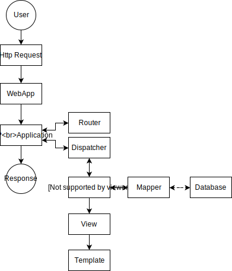

# Application Structure & Flow

The user request gets passed through the entire application to all modules. The same goes for the response which gets created at the beginning and passed through the application to be filled. The `WebApplication` automatically forwards the user request to the correct application e.g. `Backend`. Inside the application the user request gets routed and the routes are forwarded to the dispatcher which resloves the routes. 

The routes usually reference endpoints in the module `controllers` which collects the model data through the model `mapper` and creates a partial response `view` with an assigned `template` and the collected model data.

In the following only the WebApplication and Application are mentioned as the other components are explained in detail in their respective documentation.

## WebApplication

The `WebApplication` has a very limited purpose. It only initializes the user request and the empty response object. Additionally the WebApplication also initializes the `UriFactory` based on the user request and forwards the request to the corcect application. The result of the application is finally rendered in the WebApplication.

## Application

The `Application` workload depends heavily on the type of the application but in general it initializes:

* Localization
* Database
* Router
* Dispatcher
* ModuleManager
* Cache
* Account Manager
* Event Manager
* App Settings
* Page View

Furthermore the Application also performs a `CSRF` check, defines the `CSP`, authenticates the user and handles global errors such as invalid application permission, database connection error etc.